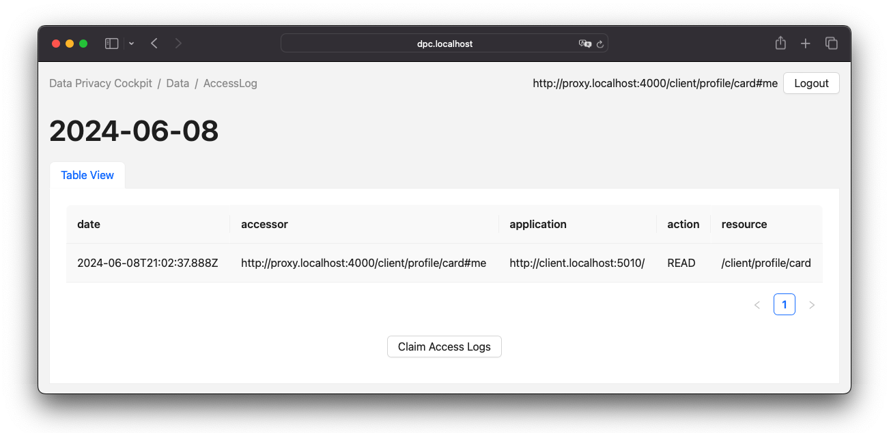

= Solid-Based Extended Access Control and Traceability in Data-Driven Web-Based Systems: Verteidigung
// Global Attributes
include::partials/Attributes.adoc[]
:lang: de
:figure-caption: Abbildung
:date: 2024-09-19
:toc: macro
:toclevels: 1
:toc-title!:
:sectnums!:
:docinfo: shared
:revealjs_controlsLayout: edges
:revealjs_hash: true
:revealjs_margin: 0.25
:revealjs_minimumTimePerSlide: 60
:revealjs_navigationMode: linear
:revealjs_slideNumber: c/t
:revealjs_slideNumber: true
:revealjs_theme: white
:revealjs_totalTime: 1500
:revealjs_viewDistance: 5
:toc-title: Agenda
:revealjs_width: 1280

{date}

{revnumber}

HTWK Leipzig

[%notitle]
== Agenda

toc::[]

== Einordnung

[%notitle]
=== Preface

Modul::
Mastermodul (C533.2 Pflichtmodul) +
{url-modulux}
Betreuer::
Herr Prof. Dr. rer. nat.
Andreas Both _(HTWK Leipzig)_ +
Herr M. Sc.
Michael Schmeißer _(mgm technology partners GmbH)_

[%notitle]
=== Unternehmen

mgm technology partners ist ein internationales Software-Unternehmen mit Fokus auf von Enterprise-Projekten.

Haupttätigkeitsbereiche des Unternehmens:: Low Code Plattform, Public Sector, Handel & Gewerbe und Versicherungen
Projektanforderungen des Unternehmens:: Keine Einschränkungen

== Thema der Arbeit

=== Hintergrund (1)

Das _Solid-Protokoll_ ist eine *Spezifikation*, mit der Menschen ihre Daten sicher in [.step.highlight-red]#*dezentralen Datenspeichern*#, den sogenannten Pods, speichern können.
Ein Pod ist vergleichbar mit einem sicheren, persönlichen Webserver für Daten.
Die [.step.highlight-red]#*Kontrolle*# darüber, welche Personen und Anwendungen auf den Pod zugreifen können, liegt bei der Person, die den Pod besitzt.

=== Hintergrund (2)

_Solid_ aggregiert mehrere Spezifikationen zu einem Standard und hat [.step.highlight-red]#*assoziierte Spezifikationen*# (z. B.: die _Solid Application Interoperability Spezifikationfootnote:[https://solid.github.io/data-interoperability-panel/specification/]_), die den Funktionsumfang ergänzen, kann also im weiteren Sinne als [.step.highlight-red]#*Ökosystem*# verstanden werden.

=== Problemstellung (1)

[%step]
* *[[ISSUE-1,ISSUE-1]] ISSUE-1:* Das Solid-Protokoll bietet nur die Möglichkeit, den Zugriff zu gewähren oder zu verweigern.
Es überwacht nicht die [.step.highlight-red]#tatsächliche Anfrage# nach einer Ressource.
* *[[ISSUE-2,ISSUE-2]] ISSUE-2:* Solid basiert auf RDF und unterstützt daher [.step.highlight-red]#vernetzte Daten#, was die Notwendigkeit der Überwachung der gespeicherten Daten erhöht.

[.notes]
--
- Problemstellungen bezüglich Zugriff und Vernetzung
--

=== Problemstellung (2)

[%step]
* *[[ISSUE-3,ISSUE-3]] ISSUE-3:* Es kann zu Änderungen an bestehenden Spezifikationen kommen, da diese verbessert werden müssen oder sich noch im [.step.highlight-red]#Entwurfsstadium# befinden.
* *[[ISSUE-4,ISSUE-4]] ISSUE-4:* Das Solid-Ökosystem wird durch [.step.highlight-red]#neu eingeführte Spezifikationen oder Schnittstellen# erweitert.
* *[[ISSUE-5,ISSUE-5]] ISSUE-5:* Aufgrund ihrer wachsenden Beliebtheit werden [.step.highlight-red]#neue Solid-Provider# eingeführt.

[.notes]
--
- Problemstellungen bezüglich des Entwicklungsstandes
--

=== Forschungsfrage

> Gibt es ein Solid-basiertes Systemdesign, das eine gesteigerte Transparenz und Zugriffskontrolle auf die angeforderten personenbezogenen Daten ermöglicht?
> Ist das System in der Lage, die Netzwerkschnittstellen herstellerunabhängig zu nutzen, ohne dass es zu signifikanten Leistungseinbußen kommt?

=== Teilfragen

[horizontal,labelwidth=16]
QUEST-1:: Kann ein Solid-basiertes System sowohl <<Funktionale Anforderungen,funktionale>> als auch <<Nicht-funktionale Anforderungen,nicht-funktionale Anforderungen>> erfüllen, ohne das Systemdesign zu beeinträchtigen?
QUEST-2:: Inwieweit trägt der Prozess zum Anstieg der Netzanfragen und der Netzbelastung bei?
QUEST-3:: Welche System- und Testparameter beeinflussen die ausgeführten Testfälle?
Wie äußert sich der Einfluss der Parameter?

[.notes]
--
- Funktional und Nicht-funktional Anforderungen werden noch erläutert.
--

=== Konzept (1)

> Datenschutzcockpit (DSC)

DSC Reverse Proxy:: Erstellung eines serverseitigen Proxys auf Anwendungsebene zur Überwachung des Datenverkehrs
DSC Client:: Darstellung und Verwaltung der Daten aus der Überwachung

=== Konzept (2)

.Screenshot eines Zugriffsprotokolls im Datenschutzcockpit.
[#ui-discovery,.text-center]

=== Weiterführendes Konzept

_Lösungen zu erwarteten Problemen_

* Strategien zur Datenerfassung: Permanent oder [.step.highlight-red]#Opt-in#
* Überprüfung der Eigentumsverhältnisse: [.step.highlight-red]#Claimingfootnote:[vgl. https://support.google.com/webmasters/answer/9008080]#

=== Funktionale Anforderungen

[horizontal,labelwidth=22]
REQ-F1:: Zugriffsprotokolle mit unterschiedlichen Ansichten je nach Mandat.
REQ-F2:: Übertragungsprotokolle mit dem spezifischen Inhalt der übertragenen Ressource.

=== Nicht-funktionale Anforderungen

[horizontal,labelwidth=22]
REQ-NF1:: Metadaten, die aus der Anfrage extrahiert werden können, sollten analysiert und die Protokolle entsprechend erweitert werden.
REQ-NF2:: Gewährleistung der Kompatibilität mit der aktuellen Version des Solid-Protokolls.
REQ-NF3:: Die Effizienz in Bezug auf die Reaktionszeit muss angemessen sein.

[.columns]
=== Qualitätsmodell

[.column]
- *System Design Quality* nach citenp:[martin_clean_2018]
* [.step.highlight-red]#Kohäsion#: _Reuse/Release Equivalence Principle_, _Common Closure Principle_ und _Common Reuse Principle_
* [.step.highlight-red]#Kopplung#: _Acyclic Dependencies Principle_, _Top-Down Design_, _Stable Dependencies Principle_ und  _Stable Abstractions Principle_

[.column]
- *Performance Efficiency* nach ISO/IEC 25010
* [.step.highlight-red]#Zeitverhalten#
* Ressourcennutzung
* Kapazität

[.notes]
--
- *Komponenten Kohäsion*
* Das Reuse/Release Equivalence Principle besagt, dass die Wiederverwendung und Freigabe gleich groß sein sollen.
* Das Common Closure Principle ist eine Methode, um Objekte zu gruppieren, die sich aus den gleichen Gründen und zur gleichen Zeit ändern.
* Das Common Reuse Principle sagt, dass Komponenten eines Systems nicht von anderen abhängig sein sollten.
- *Komponenten Kopplung*
* Das Acyclic Dependencies Principle sagt, dass man beim Modellieren darauf achten muss, dass es keine zyklischen Abhängigkeiten gibt.
* Bei einem Top-Down-Design wird das System nicht wie ein Baum entwickelt.
* Gemäß dem _Stable Dependencies Principle_ sollten Komponenten, zu denen Abhängigkeiten bestehen, stabil sein.
* Nach dem _Stable Abstractions Principle_ sollte eine stabile Komponente abstrakt sein.
--

== Design und Implementierung

=== Logische Topology

.UML 2.5.1 Komponentendiagramm der logischen Topologie
[.text-center]
[plantuml,format=svg,id="Logical_Topology_A"]
....
include::resources/diagrams/cmp_Logical_Topology_A.puml[]
....

=== Logisches Datenmodell

.Diagramm der Claim-Ergänzung für die Solid Application Interoperability
[.text-center]
[plantuml,format=svg,id="dm_Claim"]
....
include::resources/diagrams/dm_Claim.puml[]
....

[.notes]
--
- Ergänzt die Solid Application Interoperability Spezifikation
- xref:{url-docs}/Thesis.research.html#full_logical_data_model[window=_blank]
--

=== System Behavior

.UML 2.5.1 Sequenzdiagramm der vom Proxy weitergeleiteten Anfrage
[.text-center,id="behavior-ref-2"]
[plantuml,format=svg]
....
include::resources/diagrams/sd_Forwarded_request.puml[]
....

[.notes]
--
- 3 Einstiegspunkte (Auth CRUD Request, Claiming und Discovery)
--

[.columns]
== Verwandte Arbeiten

[.column]
// Motivation
- citenp:[both_german_2024]
// Projects
- _X-Roadsfootnote:[https://x-road.global/]_
- _Athumifootnote:[https://athumi.be/]_
- citenp:[diederich_xdatenschutzcockpit_2023]
// Solid and Access Control
- citenp:[esposito_assessing_2023]
- citenp:[slabbinck_enforcing_2024]

[.column]
- citenp:[slabbinck_rule-based_2023]
- citenp:[schmid_rights_2024]
// Benchmark
- Proxy-Benchmarksfootnote:[https://github.com/NickMRamirez/Proxy-Benchmarks]
- citenp:[pan_survey_2018]
- SolidBench.jsfootnote:[https://github.com/SolidBench/SolidBench.js]

== Analyse

[.columns]
=== Test-Parameter und Belegungen (1)

[.column]
- *Netzwerk-Parameter*
* Einfacher Vortest: `PRE1.a` footnote:a[`a` entspricht dem Experimentzähler]
* Probabilistische CRUD Sequenz: `TP1.a` footnote:a[]

[.column]
- *Datenschutzcockpit-Parameter (`i`)*
* Nicht beanspruchte Dateiablage: `N`
* Beanspruchte Dateiablage: `C`
* Umgangenes Proxy-Modul: `B`

[.columns]
=== Test-Parameter und Belegungen (2)

[.column]
- *Solid Ökosystem-Parameter*
* Storage Amount (`p`): `{1,10,30}`
* ShapeTree Amount (`q`): `{1,10,30}`

[.column]
- *Apache JMeter Parameters*
* Number of Threads (`r`): `{1,..,10,30}`
* Ramp-up Period: `10s`
* Loop Count: `10`

[.columns]
=== Performance Efficiency Analyse (1)

[.column]
- 10 Experimente wurden mit allen Parametern und Softwareanpassungen gestartet.
Die Belegung der dynamischen Parameter ist wie folgt: *Netzwerk-Parameter* + *Datenschutzcockpit-Parameter (`i`)* + *Storage Amount (`p`)* + *ShapeTree Amount (`q`)*  + *Number of Threads (`r`)*

[.column]
- Ausschließlich folgende Konfigurationen brachte verwertbare Ergebnisse:
* `PRE1`
* `PRE2`
* `TP1.10-B-10-10-1`
* `TP1.10-C-10-10-1`
* `TP1.10-B-10-10-2`
* `TP1.10-C-10-10-2`

=== Performance Efficiency Analyse (2)

.Zusammenfassung der Testlauffehler in Prozent
[cols="1,2,2",id="tbl-test-run-summary-errors"]
|===
^.^h| TP1.10
2+^.^h| `i`

^.^h| `p`-`q`-`r`
>.^h| B
>.^h| C

^.^h| 10-10-1
>.^| 0.00 %
>.^| 2.50 %

^.^h| 10-10-2
>.^| 0.83 %
>.^| 4.17 %
|===

=== Performance Efficiency Analyse (3)

.Durchschnittliche Reaktionszeiten der Testläuf in Sekunden
[cols="1,2,2",id="tbl-test-run-response-times-average"]
|===
^.^h| TP1.10
2+^.^h| `i`

^.^h| `p`-`q`-`r`
>.^h| B
>.^h| C

^.^h| 10-10-1
>.^|  0.04 s
>.^| 41.21 s

^.^h| 10-10-2
>.^|  0.67 s
>.^| 52.33 s
|===

=== Performance Efficiency Analyse (4)

.Durchsatz der Testläufe in Transaktionen pro Sekunde
[cols="1,2,2",id="tbl-test-run-throughput"]
|===
^.^h| TP1.10
2+^.^h| `i`

^.^h| `p`-`q`-`r`
>.^h| B
>.^h| C

^.^h| 10-10-1
>.^| 26.41 Transactions/s
>.^|  0.01 Transactions/s

^.^h| 10-10-2
>.^| 0.20 Transactions/s
>.^| 0.02 Transactions/s
|===

=== Design Quality Analyse

- _Reuse/Release Equivalence Principle_, _Common Closure Principle_, _Common Reuse Principle_, _Top-Down Design_, _Stable Dependencies Principle_ und  _Stable Abstractions Principle_: +
*✅ Keine systemischen Probleme identifizierbar*
- _Acyclic Dependencies Principle_ +
*⚠️ Zyklische Abhängigkeit vom Server zum Proxy*

[.columns]
== Diskussion

[.column]
- Probleme mit der Zuverlässigkeit der Protokollierung (Datentreuhänder, Opt-in).
- Anbieterspezifische Schnittstellen wurden genutzt.
- Solid Application Interoperability ist für die Verwendung mit einer einzigen Identität konzipiert.
- Verletzung des _Acyclic Dependencies Principle_.

[.column]
- Ordnerbasierte Strukturierung der Protokolle im Speicherbereich des Datentreuhänders.
- Die Einführung eines benutzerdefinierten Vokabulars
- Limitierung des Zugangs über _Authorization Code Flow (Basic Flow)_
- Die Leistung des Systems ist [.step.highlight-red]#Ineffizient#

include::partials/Bibliography.adoc[leveloffset=+1]
