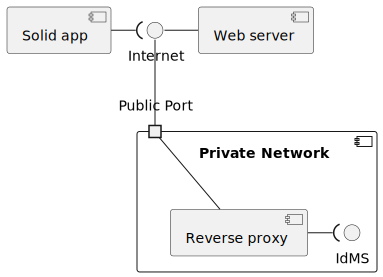
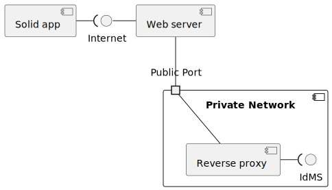

= Master-Thesis Exposé
:author: Florian Gudat <florian.gudat@guices.com>
:revnumber: v1.0
:revdate: 2023-11-08
:revremark: Leipzig
:library: Asciidoctor
:idprefix:
:toc: macro
:toc-title:
:css-signature: github

Version:: 
{revnumber}, {revdate} ({revremark})

Editors:: 
{author}

Modul (Modulnummer):: 
Mastermodul 
(C533.2 Pflichtmodul)

Modulverantwortlicher:: 
Prof. Dr.-Ing. Jean-Alexander Müller

Betreuer::
Prof. Dr. Andreas Both

Institut::
Hochschule für Technik, Wirtschaft und Kultur Leipzig 

Fakultät::
Informatik und Medien

[discrete]
== Inhaltsverzeichnis
toc::[]

// Darstellung des Themas 

Die Solid-Spezifikation erlaubt das sichere Speichern von Daten in dezentralen Datenbanken. Die Daten können dabei über das Internet an ausgewählte Identitäten wie Personen, Organisationen oder Anwendungen weitergegeben werden. Freigabeinformationen sind an die Daten gebunden und daher ebenfalls dezentral organisiert. Sowohl die Daten als auch die Freigabeinformationen haben einen Eigentümer, der für die Verwaltung dieser Inhalte zuständig ist.

Solid-Server implementieren die serverseitigen Spezifikationen und Anforderungen von Solid. Sie können entweder als eigenständige Instanz gehostet oder über öffentliche Anbieter footnote:[https://solidproject.org/users/get-a-pod#get-a-pod-from-a-pod-provider] genutzt werden, um die Aufgaben eines Identity-Management-Systems in einer dezentralen Infrastruktur zu erfüllen.

Das Thema der Arbeit befasst sich mit einem Dienst, der die Möglichkeit bietet, Informationen aus Anfragen gemäß der Solid-Spezifikation auszulesen, auszuwerten und bei Bedarf zu modifizieren. Dies soll unabhängig von Art und Implementierung des Solid-Servers möglich sein. Um dieses Ziel zu erreichen, wird ein Reverse-Proxy footnote:[https://www.cloudflare.com/de-de/learning/cdn/glossary/reverse-proxy/] als Vermittler implementiert, der eine generische Verarbeitung von Anfragen ermöglicht und repetitive Prozesse standardisiert. Ein Datenschutzcockpit wird als Implementierungsbeispiel umgesetzt, welches das Compliance & Audit footnote:[https://www.internet-sicherheit.de/forschung/forschungsprojekte/abgeschlossene-forschungsprojekte/identity-management/idm-referenzmodell/compliance-audit/] des Referenzmodells für Identity-Management footnote:[https://www.internet-sicherheit.de/forschung/forschungsprojekte/abgeschlossene-forschungsprojekte/identity-management/idm-referenzmodell/] bedient. Zudem gewährt es dem Eigentümer Zugang zu den Aufgaben des Compliance-Managements, Monitoring, Reporting und Auditing.

== Motivation

Bei dezentralen Systemen geht der Überblick über die Ablagen verloren, insbesondere bei steigendem Datenbestand.
Bei geteilten Daten ist dies problematisch, da unautorisierte Zugriffe auf diese Daten stattfinden können, obwohl der Eigentümer dies nicht beabsichtigt.
Dies erfordert den Schutz sensibler Daten sowie die Überprüfung von Berechtigungen und Administrationsaufgaben im Rahmen des Compliance-Managements, zusammen mit einem kontinuierlichen Monitoring und Reporting von Zugriffen. Diese Funktionen sind von der Solid-Spezifikation nicht abgedeckt und müssen zur Implementierung ergänzt werden.

Im Zuge einer Showcase-Implementierung für ein E-Governance-Verfahren footnote:[https://github.com/guddii/showcase-solid-egovernance/] fiel auf, dass die Autorisierung einer Identität in jeder Iteration erneut durchgeführt werden muss, wodurch wichtige Informationen verloren gehen. Das verwendete Autorisierungsverfahren ist eine Inrupt-spezifische Lösung und lediglich in der Unternehmenslösung des Solid-Servers implementiert.

Die beiden Problemstellungen demonstrieren die Notwendigkeit einer generischen Lösung, um individuelle Herausforderungen der verschiedenen softwaretechnischen Lösungen effektiv anzugehen und diese gegebenenfalls erweitern zu können.

// Relevanz

Die Arbeit ist von Relevanz, da sie die Funktionalität von Solid-Instanzen erweitert, die nicht durch die Spezifikation abgedeckt werden. Solid übernimmt die Aufgaben eines Identity-Management-Systems und es ist daher notwendig, dass die Kriterien für ein solches System in ausreichender Qualität erfüllt werden. 
Ein zentraler Bestandteil ist das Compliance-Management, Monitoring, Reporting und Auditing, da es sich um ein System von über das Internet verknüpften Teilsystemen handelt. Hier sollte das Solid-Prinzip weiterhin gelten, dass der Eigentümer die Kontrolle über seine eigenen Daten hat.

== Zielsetzung

// Ziel der Arbeit und Erkenntnisinteresse

Das Ziel der Arbeit besteht darin, eine generische Lösung zu entwickeln, die beliebige Erweiterungen und Standardisierung von Prozessen ermöglicht. Als Beispiel hierfür werden Anforderungen des Compliance-Managements, Monitorings, Reportings und Audits umgesetzt, da diese ausreichend komplexe Demonstrationszwecke erfüllen. Die Lösung soll unabhängig von der Art des Hostings und der Implementierung des Solid-Servers sein. Um repetitive Prozesse zu vereinheitlichen, wird diese Lösung als Reverse-Proxy implementiert, der eine generische Verarbeitung von Anfragen erlaubt. Als Beispiel für eine solche Implementierung wird ein Datenschutzcockpit umgesetzt, das die Anforderungen des Compliance-Managements, Monitorings, Reportings und Auditings im Rahmen des Identity-Management-Referenzmodells erfüllt. Hier werden dem Eigentümer die Aufgaben des Compliance-Managements, Monitorings, Reportings und Auditing zugänglich gemacht.

Die Untersuchung befasst sich mit der Fragestellung, ob die Anforderungen an ein Identity-Management-System in einer dezentralen Infrastruktur erfüllt werden können und welche Vor- und Nachteile daraus resultieren.
Die Rahmenbedingungen für die technische Umsetzung sind durch die Solid-Spezifikation gegeben.

// Ergebnisse skizzieren

Zur Demonstration und Überprüfung von Funktionen werden zwei Makroarchitekturen umgesetzt. Die erste Architektur ist eine Client-Server-Architektur, die direkt auf das Identity-Management-System zugreifen kann. Die zweite Architektur ist eine Backend-For-Frontend-Architektur, die den Zugriff über den Webserver auf das Identity-Management-System weiterleitet. In der Arbeit werden beide Architekturen gegenübergestellt und ihre Vor- und Nachteile herausgearbeitet. 

.Client-Server-Architektur im privaten Netzwerk
[.text-center, caption="Abbildung 1: "]

.Backend-For-Frontend-Architektur im privaten Netzwerk
[.text-center, caption="Abbildung 1: "]

Die vorliegenden Diagramme präsentieren Entwürfe für private Netzwerke. In der Umsetzung wird auch der Fall von öffentlich zugänglichen Netzwerken betrachtet.

== Forschungsstand

- Stand der aktuellen Forschung
- zentrale Theorien des Themas

== Forschungskonzept

- Forschungsfrage(n)
- Hypothesen
- Methodik + Begründung
- Daten
- evtl. benötigte Mittel

== Vorläufige Gliederung

Vorläufige Gliederung zur Strukturierung

== Zeitplan

Tabellarische Darstellung der Zeitplanung deiner Masterarbeit (dient als Orientierung und hilft, Probleme frühzeitig zu erkennen)

[bibliography]
== Literaturverzeichnis
bibliography::[]
