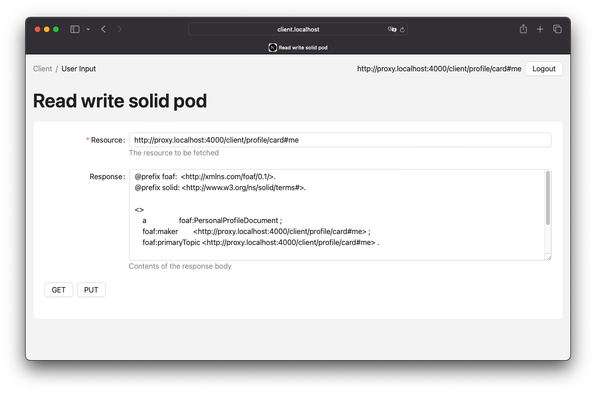
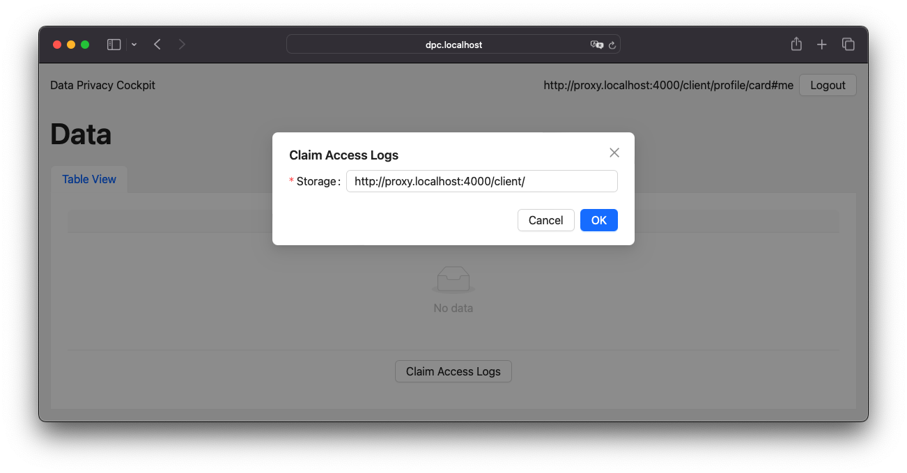
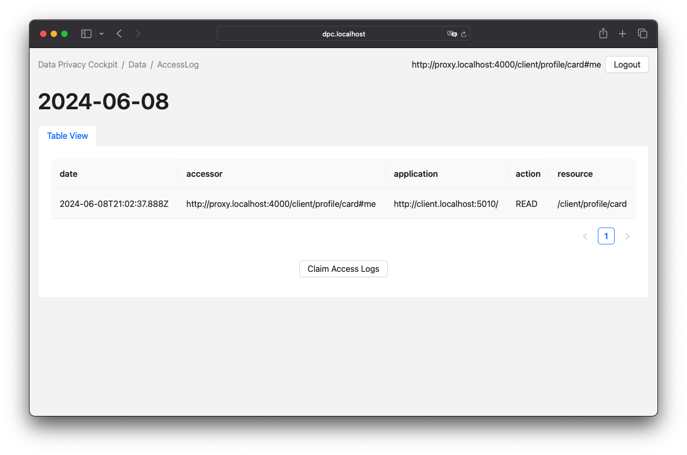

= Process Entries

There are three main behaviors that reflect interactions that can be executed directly or indirectly by the client: CRUD requests to a given resource, claiming log data, and discovering this data.
The reference section defines subsequences that may be used in each of these interactions.

== Authorised CRUD Requests

The process of authorizing a request can be divided into two steps.
Firstly, an authorization token will be requested using an <<Authorization Client Credentials Flow>> or an alternative authorization process such as an <<Authorization Code Flow>>.
Secondly, the CRUD request will be sent with an authorization header and the response will be provided accordingly.
The key difference is that the request and response will be forwarded by the proxy instance.

.Sequence diagram of an authorized CRUD request
[.text-center]
[plantuml,format=svg]
....
include::../../resources/diagrams/sd_Request_a_resource.puml[]
....

All requests can be executed with any HTTP client that supports the Solid Protocol. To demonstrate this, a simple web HTTP client has been introduced in this project, as shown in xref:ui-crud[xrefstyle=short].

.Screenshot of a Solid HTTP Client <<UI>>.
[#ui-crud,.text-center]

== Log Claiming

Network logs are captured by storage, not by WebID, and it is necessary to associate the data with a WebID at some point to make it readable to the owner.
This is done by a claiming mechanism.
This requires a Solid application that has access to both the user storage and the DPC storage.
Both connections are handled by the DPC API server, and when the connections are established, the API initializes an verification code on behalf of the client agent to be verified by the DPC API server when it discovers the logs.

.Sequence diagram of the log claiming process
[.text-center]
[plantuml,format=svg]
....
include::../../resources/diagrams/sd_Log_claiming.puml[]
....

The process of claiming access logs is relatively straightforward, requiring only a single form input in the <<UI>>. When an agent is logged in, the related storage can be detected automatically. If not, the input field allows custom <<URL>> input. Upon submission, the rest of the process occurs in the background. xref:ui-claiming[xrefstyle=short] presents a screenshot of this <<UI>>.

.Screenshot of a DPC Client <<UI>> while claiming the access logs.
[#ui-claiming,.text-center]

== Log Discovery

The logs in the DPC API server are represented as routes.
These routes will either return an empty turtle file or attempt to resolve the claim and receive the actual files from the claimed storages.

.Sequence diagram of the discovery of logs
[.text-center]
[plantuml,format=svg]
....
include::../../resources/diagrams/sd_Log_discovery.puml[]
....

Upon successful claiming of an access log container, the agent is presented with a view of the logged entries. This view is represented by a table, as illustrated in xref:ui-discovery[xrefstyle=short].

.Screenshot of a DPC Client <<UI>> listing the access logs.
[#ui-discovery,.text-center]

